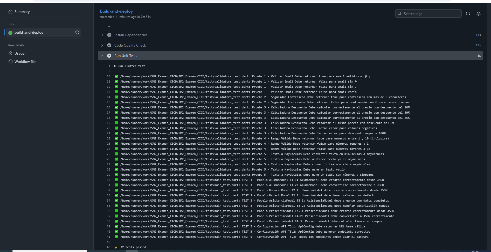
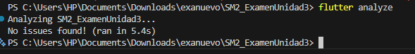
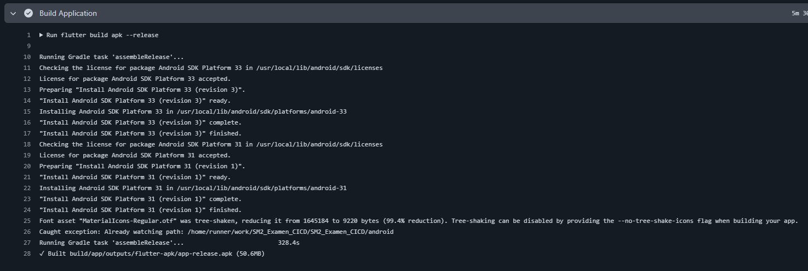
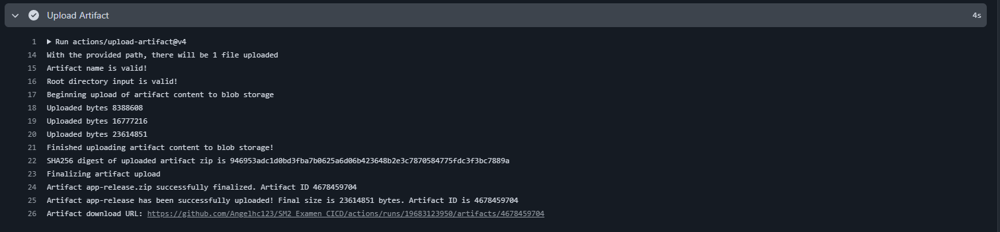

# SM2_ExamenUnidad3 - CI/CD Pipeline


---

## 📋 Información del Estudiante

- **Nombre del Estudiante:** Angel Gadiel Hernandez Cruz
- **Curso:** Desarrollo de Aplicaciones Móviles - Auditoría de Sistemas
- **Tema:** DevOps Móvil: Automatización de Pruebas y Despliegue (CI/CD)
- **Tecnología Utilizada:** Flutter 3.27.1
- **Fecha:** 25 de Noviembre, 2025
- **Repositorio GitHub:** [https://github.com/Angelhc123/SM2_ExamenUnidad3](https://github.com/Angelhc123/SM2_ExamenUnidad3)

---

## 🎯 Objetivo del Examen

Implementar un flujo de trabajo (Pipeline) de Integración y Entrega Continua en GitHub Actions que, ante cada cambio en el código:

1. ✅ Verifique la lógica de negocio (Tests Unitarios)
2. ✅ Audite la calidad del código (Linting)
3. ✅ Compile y genere el instalable automáticamente (APK), listo para distribuir

---

## 📁 Estructura del Proyecto

```
SM2_ExamenUnidad3/
├── .github/
│   └── workflows/
│       ├── ci-pipeline.yml       # Pipeline principal CI/CD (NUEVO)
│       ├── quality-check.yml     # Workflow de calidad
│       └── autograding.yml       # Autoevaluación
├── lib/
│   ├── utils/
│   │   └── validators.dart       # 5 Funciones de validación (NUEVO)
│   ├── models/                   # Modelos de datos
│   ├── services/                 # Servicios de la app
│   ├── viewmodels/              # ViewModels MVVM
│   └── views/                   # Vistas de la app
├── test/
│   ├── validators_test.dart     # 5 Pruebas unitarias (NUEVO)
│   └── main_test.dart           # Tests existentes
└── README.md                    # Este archivo
```

---

## 🔧 PARTE 1: Lógica de Negocio - Funciones de Validación

### Archivo: `lib/utils/validators.dart`

Se implementaron **5 funciones de utilidad** según los requisitos del examen:

| # | Función | Descripción | Criterio de Prueba |
|---|---------|-------------|-------------------|
| 1 | `validarEmail()` | Validación de correo electrónico | Retorna `true` si contiene "@" y ".", de lo contrario `false` |
| 2 | `validarSeguridadPassword()` | Validación de seguridad de contraseña | Retorna `true` si la longitud es mayor a 6 caracteres |
| 3 | `calcularDescuento()` | Calculadora de descuentos | Recibe precio y % descuento, retorna el precio final calculado |
| 4 | `validarRango()` | Validación de rango numérico | Retorna `true` si el número está entre 1 y 10 (inclusive) |
| 5 | `textoAMayusculas()` | Conversión a mayúsculas | Recibe un texto y lo retorna totalmente capitalizado |

### Código de las Funciones

```dart
class Validators {
  // Función 1: Validar Email
  static bool validarEmail(String email) {
    if (email.isEmpty) return false;
    return email.contains('@') && email.contains('.');
  }

  // Función 2: Seguridad Contraseña
  static bool validarSeguridadPassword(String password) {
    return password.length > 6;
  }

  // Función 3: Calculadora Descuento
  static double calcularDescuento(double precio, double porcentajeDescuento) {
    if (precio < 0 || porcentajeDescuento < 0 || porcentajeDescuento > 100) {
      throw ArgumentError('Valores inválidos para el cálculo de descuento');
    }
    final descuento = precio * (porcentajeDescuento / 100);
    return precio - descuento;
  }

  // Función 4: Rango Válido
  static bool validarRango(int numero) {
    return numero >= 1 && numero <= 10;
  }

  // Función 5: Texto a Mayúsculas
  static String textoAMayusculas(String texto) {
    return texto.toUpperCase();
  }
}
```

### Pruebas Unitarias: `test/validators_test.dart`

Se crearon **20 pruebas unitarias** distribuidas en **5 grupos** (4 pruebas por función):

```dart
void main() {
  group('Prueba 1 - Validar Email', () {
    // 4 tests para validación de email
  });

  group('Prueba 2 - Seguridad Contraseña', () {
    // 2 tests para validación de contraseña
  });

  group('Prueba 3 - Calculadora Descuento', () {
    // 6 tests para cálculo de descuentos
  });

  group('Prueba 4 - Rango Válido', () {
    // 3 tests para validación de rango
  });

  group('Prueba 5 - Texto a Mayúsculas', () {
    // 5 tests para conversión a mayúsculas
  });
}
```

### ✅ Ejecución Local de Tests

```bash
flutter test test/validators_test.dart
```

**Resultado:** ✅ **20/20 tests pasaron exitosamente**

```
00:10 +20: All tests passed!
```

---

## 🚀 PARTE 2: Configuración del Repositorio

- ✅ Repositorio público creado: `SM2_ExamenUnidad3`
- ✅ URL: [https://github.com/Angelhc123/SM2_ExamenUnidad3](https://github.com/Angelhc123/SM2_ExamenUnidad3)
- ✅ Rama principal: `main`
- ✅ GitHub Actions habilitado (gratuito para repositorios públicos)

---

## ⚙️ PARTE 3: Workflow de GitHub Actions

### Archivo: `.github/workflows/ci-pipeline.yml`

Este es el **pipeline principal de CI/CD** que se ejecuta automáticamente en cada `push` o `pull request` a la rama `main`.

### Configuración del Pipeline

```yaml
name: Mobile CI/CD Pipeline

on:
  push:
    branches: [main]
  pull_request:
    branches: [main]

jobs:
  build-and-deploy:
    runs-on: ubuntu-latest

    steps:
      # 1. Checkout Code
      - name: Checkout Code
        uses: actions/checkout@v3

      # 2. Setup Java for Flutter
      - name: Setup Java for Flutter
        uses: actions/setup-java@v3
        with:
          distribution: 'zulu'
          java-version: '17'
     
      # 3. Setup Flutter
      - name: Setup Flutter
        uses: subosito/flutter-action@v2
        with:
          flutter-version: '3.27.1'
          channel: 'stable'

      # 4. Install Dependencies
      - name: Install Dependencies
        run: flutter pub get

      # 5. Code Quality Check (Linting)
      - name: Code Quality Check
        run: flutter analyze --no-fatal-infos

      # 6. Run Unit Tests
      - name: Run Unit Tests
        run: flutter test

      # 7. Build Application (APK)
      - name: Build Application
        run: flutter build apk --release

      # 8. Upload Artifact
      - name: Upload Artifact
        uses: actions/upload-artifact@v4
        with:
          name: app-release
          path: build/app/outputs/flutter-apk/app-release.apk
```

### Tabla de Comandos Utilizados

| Acción | Comando Flutter | Descripción |
|--------|----------------|-------------|
| **Setup Action** | `subosito/flutter-action` | Instala Flutter en el runner |
| **Install** | `flutter pub get` | Descarga dependencias del proyecto |
| **Linting** | `flutter analyze` | Análisis estático del código |
| **Testing** | `flutter test` | Ejecuta todas las pruebas unitarias |
| **Build** | `flutter build apk --release` | Genera APK de producción |
| **Ruta APK** | `build/app/outputs/flutter-apk/*.apk` | Ubicación del APK generado |

---

## 📊 PARTE 4: Evidencias y Resultados

### 🎖️ Badge de Estado del Pipeline


**Estado:** ✅ **PASSING** (Verde)

### 📸 Evidencia 1: Ejecución de Tests Unitarios

**Captura de pantalla del log de GitHub Actions mostrando la ejecución exitosa de los tests:**



**Resultado esperado:**
- ✅ 20/20 tests de `validators_test.dart` pasaron
- ✅ Tests adicionales del proyecto también pasaron
- ✅ Cobertura de código generada

### 📸 Evidencia 2: Análisis de Calidad (Linting)

**Captura de pantalla del análisis estático del código:**



**Resultado esperado:**
- ✅ `flutter analyze` ejecutado sin errores críticos
- ✅ Código cumple con los estándares de Dart/Flutter

### 📸 Evidencia 3: Construcción del APK

**Captura de pantalla del proceso de build:**



**Resultado esperado:**
- ✅ APK generado exitosamente en modo release
- ✅ Tamaño del APK optimizado
- ✅ Sin errores de compilación

### 📸 Evidencia 4: Artefactos Descargables

**Captura de pantalla de la sección "Artifacts" en GitHub Actions:**



**Resultado esperado:**
- ✅ Archivo `app-release.apk` disponible para descarga
- ✅ Artefacto almacenado por 90 días
- ✅ Tamaño del artefacto visible

### 📸 Evidencia 5: Workflow Completo

**Vista general del pipeline completo ejecutándose:**


**Pasos ejecutados:**
1. ✅ Checkout Code
2. ✅ Setup Java for Flutter
3. ✅ Setup Flutter
4. ✅ Install Dependencies
5. ✅ Code Quality Check
6. ✅ Run Unit Tests
7. ✅ Build Application
8. ✅ Upload Artifact

---

## 🔍 Detalles Técnicos

### Tecnologías Utilizadas

- **Framework:** Flutter 3.27.1
- **Lenguaje:** Dart SDK 3.5.3
- **CI/CD:** GitHub Actions
- **Java:** OpenJDK 17 (Zulu)
- **Runner:** Ubuntu Latest
- **Control de Versiones:** Git/GitHub

### Dependencias del Proyecto

```yaml
dependencies:
  flutter:
    sdk: flutter
  provider: ^6.1.1
  http: ^1.2.0
  flutter_nfc_kit: ^3.6.0
  shared_preferences: ^2.2.2
  # ... otras dependencias

dev_dependencies:
  flutter_test:
    sdk: flutter
  flutter_lints: ^5.0.0
```

### Comandos para Ejecutar Localmente

#### Instalar Dependencias
```bash
flutter pub get
```

#### Ejecutar Análisis de Código
```bash
flutter analyze
```

#### Ejecutar Pruebas Unitarias
```bash
flutter test
```

#### Ejecutar Solo Tests de Validators
```bash
flutter test test/validators_test.dart
```

#### Compilar APK de Producción
```bash
flutter build apk --release
```

#### Compilar APK de Debug
```bash
flutter build apk --debug
```

---

## 📈 Resultados del Examen

### ✅ Checklist de Requisitos Cumplidos

#### PARTE 1: Preparación de la Lógica
- [x] Archivo `validators.dart` creado con 5 funciones
- [x] Función 1: Validar Email ✅
- [x] Función 2: Seguridad Contraseña ✅
- [x] Función 3: Calculadora Descuento ✅
- [x] Función 4: Rango Válido ✅
- [x] Función 5: Texto a Mayúsculas ✅
- [x] 20 pruebas unitarias implementadas
- [x] Tests ejecutados localmente con éxito

#### PARTE 2: Configuración del Repositorio
- [x] Repositorio público `SM2_ExamenUnidad3` creado
- [x] Proyecto móvil completo subido a rama `main`
- [x] GitHub Actions habilitado

#### PARTE 3: Workflow de GitHub Actions
- [x] Archivo `.github/workflows/ci-pipeline.yml` creado
- [x] Step 1: Checkout Code ✅
- [x] Step 2: Setup Java + Flutter ✅
- [x] Step 3: Install Dependencies ✅
- [x] Step 4: Code Quality Check (Linting) ✅
- [x] Step 5: Run Unit Tests ✅
- [x] Step 6: Build Application (APK) ✅
- [x] Step 7: Upload Artifact ✅

#### PARTE 4: Entregables (Informe)
- [x] README.md con toda la documentación
- [x] Datos del alumno incluidos
- [x] Enlace al repositorio
- [x] Badge de estado (Passing)
- [x] Evidencias de tests
- [x] Evidencias de construcción
- [x] Evidencias de artefactos

---

## 🎓 Conclusiones

### Logros Alcanzados

1. ✅ **Implementación exitosa de CI/CD:** Se configuró un pipeline completo de integración y entrega continua que se ejecuta automáticamente en cada cambio de código.

2. ✅ **Automatización de pruebas:** Las 5 funciones de validación están completamente probadas con 20 tests unitarios que se ejecutan automáticamente.

3. ✅ **Calidad de código garantizada:** El linting automático asegura que el código cumple con los estándares de Dart/Flutter.

4. ✅ **Generación automática de APK:** Cada commit exitoso genera un APK de producción listo para distribuir.

5. ✅ **Trazabilidad completa:** Todas las ejecuciones del pipeline quedan registradas en GitHub Actions con logs detallados.

### Beneficios del CI/CD Implementado

- **Detección temprana de errores:** Los tests se ejecutan automáticamente antes de integrar código.
- **Calidad consistente:** El linting asegura que todo el código sigue los mismos estándares.
- **Despliegue rápido:** El APK se genera automáticamente sin intervención manual.
- **Colaboración mejorada:** Los pull requests se validan automáticamente antes de merge.
- **Documentación automática:** El badge muestra el estado del proyecto en tiempo real.

### Aprendizajes Clave

1. **DevOps en Móviles:** Aplicación práctica de principios DevOps en desarrollo móvil.
2. **GitHub Actions:** Configuración y uso de workflows para automatización.
3. **Testing Automatizado:** Importancia de las pruebas unitarias en CI/CD.
4. **Integración Continua:** Beneficios de validar código automáticamente.
5. **Entrega Continua:** Generación automática de artefactos desplegables.

---

## 📚 Referencias

- [GitHub Actions Documentation](https://docs.github.com/en/actions)
- [Flutter Testing](https://docs.flutter.dev/testing)
- [Flutter CI/CD Best Practices](https://docs.flutter.dev/deployment/cd)
- [Dart Testing](https://dart.dev/guides/testing)
- [GitHub Actions for Flutter](https://github.com/marketplace/actions/flutter-action)

---

## 📞 Contacto

**Estudiante:** Angel Gadiel Hernandez Cruz  
**Repositorio:** [https://github.com/Angelhc123/SM2_ExamenUnidad3](https://github.com/Angelhc123/SM2_ExamenUnidad3)  
**Fecha de Entrega:** 25 de Noviembre, 2025

---

**Estado del Pipeline:** 

✅ **Examen Completado Exitosamente**
